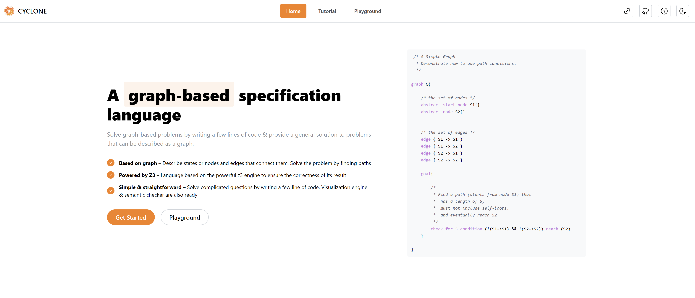
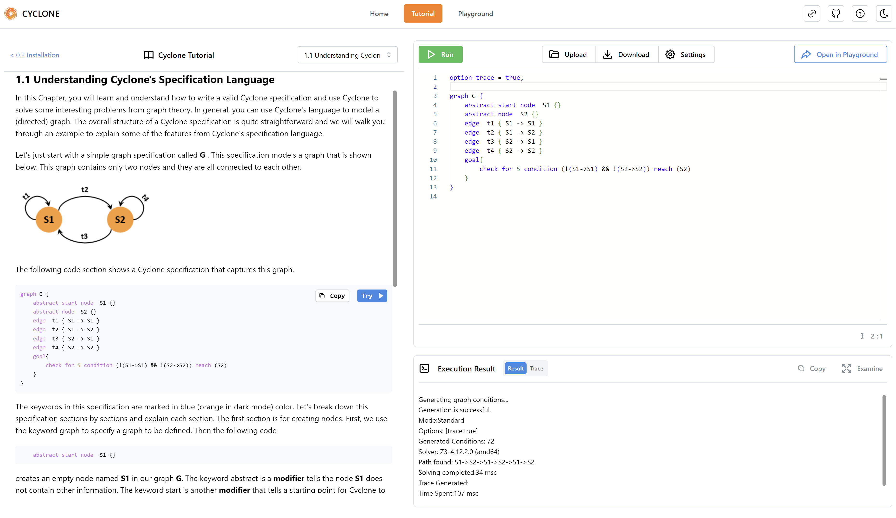
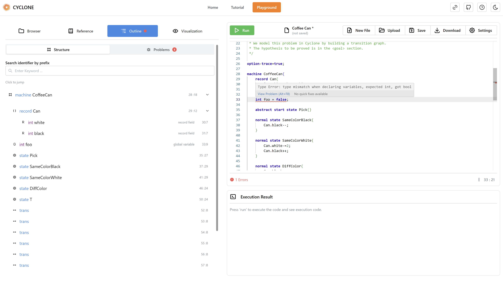
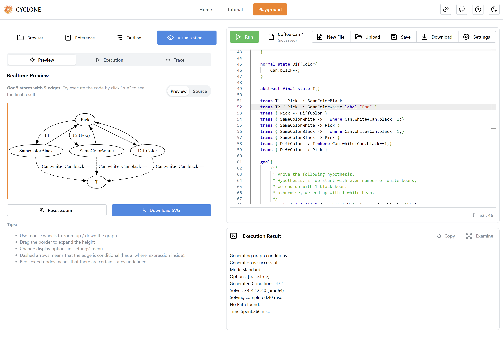
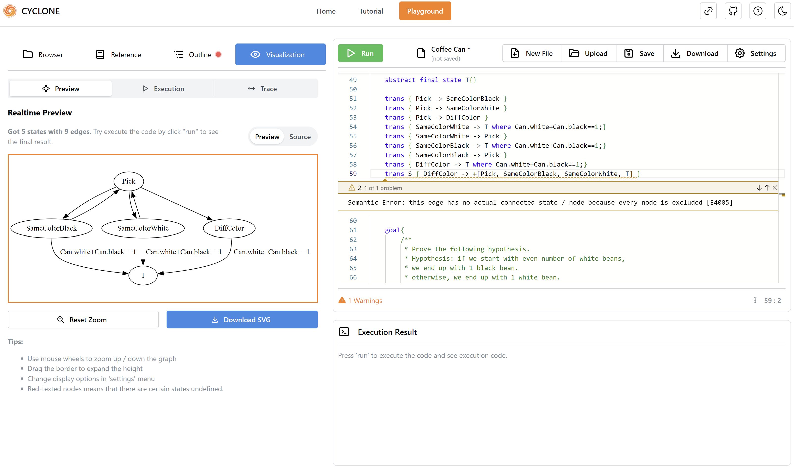
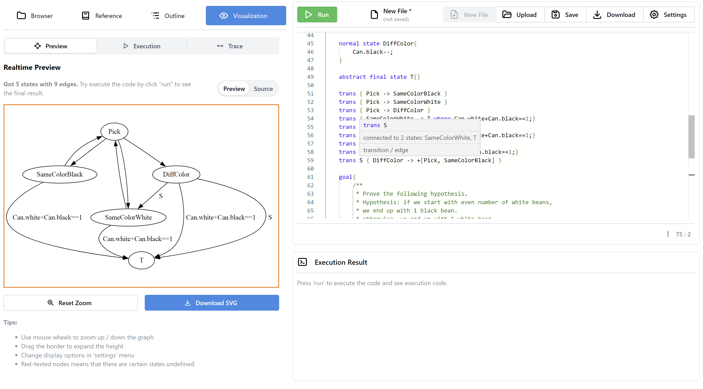

# Cyclone Online Editor

Cyclone online editor is an online development environment for the [Cyclone Specification Language](https://classicwuhao.github.io/cyclone_tutorial/tutorial-content.html). 

The website includes an interactive Cyclone code editor and a tutorial page designed for learning the Cyclone language & writing Cyclone source code online.

This project uses [cyclone analyzer](https://github.com/lucid-brndmg/cyclone-analyzer) for parsing and analyzing cyclone's source code. See its readme file for details.

*This project is a final year project (CS440[A]) at Maynooth University.*

## Acknowledgements

This project is guided under the supervision of [Dr.Hao Wu](https://classicwuhao.github.io/) with some suggestions from [Dr. Vanush Paturyan](https://www.maynoothuniversity.ie/people/vanush-paturyan).

All the Cyclone examples (files ended with `.cyclone`) & all the Cyclone tutorials (All the Markdown contents in `raw/tutorial`) are written by Dr.Hao Wu & The Cyclone Team. See [Contributors](https://classicwuhao.github.io/cyclone_tutorial/about.html) for details.

## Features

Website Features:
- Written in React & Next.js for a better performance
- Using [Monaco Editor](https://microsoft.github.io/monaco-editor/), the editor that powers VSCode, as the underlying code editor in order to get a closer user experience of VSCode
- Responsive layout and using [Mantine](https://mantine.dev/) as the UI framework
- Dark Mode

Code Editor Features:
- **Syntax Highlighting:** Display highlighted source code and supports multiple themes.
- **Syntactic & Semantic Analysis:** Check cyclone source code for syntax errors, type errors and semantic errors & warnings. Errors will be highlighted in real-time on the editor.
- **Hover Information:** Display type info & reference docs when mouse hovered on keywords or identifiers.
- **Code Completion & Snippets:** Provide auto-completions & snippets when typing. Scoped identifiers could be provided as well.
- **Code Execution:** Execute cyclone source code online & get result and traces.
- **Code Lens:** Show realtime state & edge relations, all operators for transitions supported (such as `+`, `<->`, `*`, etc...)

Other Features:
- **File Browser:** Provides a file browser to load official examples instantly, also user may save (or load) their source code inside the browser.
- **Quick Reference:** Look up language keywords, build-in functions & operators, compile options instantly.
- **Code Outline:** View code structure in a tree and jump to definition in one click just like VSCode. Also view all errors & warnings as list.
- **Visualization:** Preview cyclone's state & edge (transition) defined in the source code as graph using [Graphviz](https://graphviz.org/) in real-time. View execution result & trace as images.

Development Features:
- Easily managing code snippets, code examples and editor themes.
- Add additional tutorial chapters & reference documentation to the website **using only markdown**. No need to manually writing JSON manifest.
- Uses static-site generation technique to generate static pages automatically
- No large JSONs are imported, all static resources are dynamically requested to get a better user experience

## Screenshots













## Getting Started
Clone this repo to any location, run:
```shell
cd cyclone-online-editor
npm install # or yarn install
npm run prep # prepare environment
```

### Execution Server

If there is no existing execution server ready, it must be prepared as well:

```shell
cd execution_server
npm install
mv config.json.example config.json

# set up config or env file
```
Please make sure that java environment is installed and cyclone's compiler could be executed locally.

Then configure the cyclone environment by editing `execution_server/config.json`. Please notice that `cyclone.path` must be correctly set to cyclone's compiler path, and `cyclone.sourcePath` should be a valid temporary directory where all the temp files will be stored.

By default, no extra dependency is needed to run the execution server. However, if performance and concurrency are considered, please configure this server by reading [execution server](#execution-server-1).

Launch the execution server by entering this inside execution server's root:
```shell
# execute this inside execution_server/
npm run start
```

### Launch Frontend
The environment is now ready. To start the dev server, run:
```shell
npm run dev
```

To deploy on a server, run:
```shell
npm run build
npm run start
```

These are just standard Next.js operations. All Next.js operations should be supported since this project is built upon Next.js.

## Development

### Project Structure

Here is a basic structure for the project:
```
.
├── execution_server
│   └── src
├── public
│   ├── dynamic
│   └── vs
├── raw
│   ├── code_example
│   ├── reference
│   └── tutorial
├── resource
│   ├── image
│   └── tutorial
├── scripts
│   └── utils
└── src
    ├── component
    ├── core
    ├── lib
    ├── pages
    ├── state
    └── styles
```

There are several directories that worth noticing:

| path              | description                                                                                                                                                                                                                                                                               |
|-------------------|-------------------------------------------------------------------------------------------------------------------------------------------------------------------------------------------------------------------------------------------------------------------------------------------|
| /execution_server | The execution server that executes cyclone code. Consider this the 'backend' of the editor.                                                                                                                                                                                               |
| /public           | Static files for Next.js. Some of the generated files are included.                                                                                                                                                                                                                       |
| /public/dynamic   | Stores generated code example, reference document and editor theme definitions. Please do not edit them directly                                                                                                                                                                          |
| /public/vs        | Stores resource files that are required by the editor component (monaco editor)                                                                                                                                                                                                           |
| /raw              | Stores raw resources for code examples, reference documents and tutorial pages (both in Markdown)                                                                                                                                                                                         |
| /resource         | Stores generated tutorial HTMLs, images, resource manifests and some configurations in JSON.                                                                                                                                                                                              |
| /scripts          | Stores code generation scripts in JS and Shell. Execute these scripts only at repo's root directory and DO NOT execute them anywhere else.                                                                                                                                                |
| /src              | Source code directory. Component structures are equivalent to Next.js page router's structure and `core` contains the core logic for the semantic checker and other modules of cyclone. |

### Managing Resources

There are several resources included by the website: 
- Code Examples
- Editor Theme
- Tutorial Documents
- Reference Documents

These resources could be managed easily and their manifests can be automatically generated using scripts.

#### Code Examples

Code examples are cyclone source code files that represents official code examples to show to the user. Code examples are placed at `raw/code_example` directory. Adding code examples by creating `.cyclone` files inside the folder and the filename will be used as title.

After creating, make sure to run this command to update the manifest:
```shell
# MAKE SURE TO RUN THIS AT REPO'S ROOT (Where package.json lies)
npm run gencodeexample
```

The manifest file of all code examples are at `resource/code_example_manifest.json`, and please do not edit it directly since it's a generated file.

#### Editor Themes

Editor themes are monaco editor's color scheme configuration that used by users. VSCode themes could be converted [here](https://vsctim.vercel.app/). A theme file is a JSON file that represents a color scheme.

This project uses [monaco-themes](https://github.com/brijeshb42/monaco-themes) to provide several color schemes. If you wish to add your own color schemes, edit `scripts/generate_theme.js` and add the path that holds all the JSON file into `themePaths` array. Finally, run this:

```shell
# MAKE SURE TO RUN THIS AT REPO'S ROOT (Where package.json lies)
npm run gentheme
```

And all the theme files should be copied to `/public/theme`. File names will be used as theme titles and a variation of filename will be used as theme identifiers.

#### Tutorial documents

Tutorial documents are Cyclone's tutorial documents written in Markdown. These documents are placed inside `/raw/tutorial` and could be edited directly.

If you wish to add a tutorial document, create a new markdown file that holds the content. The filename of the tutorial represents the id. In each document, add these configurations on the head of the markdown:

```markdown
---
# The title of the document
title: "0.2 Installation"

# Previous and next document that used for navigating, written in ID
prev: "01-what-is-cyclone"
next: "11-understanding-cyclone-spec-lang"

# Document order number. The website's menu will display them in ascending order
order: 2
---

... Document Main Content ...
```

Please notice that there is a `_default.md` inside that directory. This file represents the main page (table of content, or anything you wish) for the tutorial. In this file's configuration, only `title` and `next` is needed. Please do not delete this file.

If any changes happened to any documents, make sure to run this to re-generate html files from markdown:

```shell
# MAKE SURE TO RUN THIS AT REPO'S ROOT (Where package.json lies)
npm run gentutorial
```

And then documents will be generated as HTML files for Next.js to load also a manifest is automatically generated.

For code blocks inside tutorial documents, if a code block has the language `cyclone` and contains a `machine` or `graph` syntax, a shortcut to execute the code will be displayed on UI when user browsing. For example:

````markdown
Here is an example that has the code execution feature:

```cyclone
machine SomeMachine {
    // ...Code example content
}
```

While this code block doesn't:

```cyclone
check for 1, 2, 3 reach (S1)
```
Because it does not contain valid executable Cyclone source code.

This block would have no code highlighting effect at all:
```
trans {A -> B}
```
Because no 'cyclone' language mark was marked.

````

**Notice the 'cyclone' language mark is required for each highlighted code blocks otherwise there will be no highlighting effect for the block.** This rule also applies for reference documents.

#### Reference Documents

Reference documents are simple documents that describes the language components such as keywords, operators or compiler options. These documents will be displayed when:

- User is at editor's reference panel, and user could visit all reference documents
- User's mouse is hovering on some keyword, identifier or operator on the editor, and the document (if exists) will be popped up for user to examine its info (like VSCode)

These documents are separated by categories which named by *groups* inside manifest. A group is just a folder containing markdown files that describes a certain keyword. For example, 'Builtin Functions' could be a group, and each builtin function should be a separate Markdown document. 

The root folder for reference documents is at `raw/reference`. Each sub-folder inside that directory represents a group. 

To create a group, create a folder inside that directory and put Markdown documents inside. A valid group (sub-folder) should contain a `_group.md` with optional description of group content, but these configurations must be written at the head of that file:
```markdown
---
# These info are always required even if this file have no text content

# Group title
title: "Compiler Options"

# Optional. 
# If you wish to display this document's content every time when user hover on some keywords belongs to the group on the editor, you could specify these.
# It will be meaningless if this document have no content.
keywords: ["option", "log", "trace"]

# Unique group ID
id: "cmp_opts"
---

... OPTIONAL content, if no text is here then it will not be generated to HTML ...
```

Please note that `keyword` is an optional array that contains keywords that would trigger this document when user's mouse hovering on the source code. Keywords could be duplicated in multiple documents: A keyword could have many documents displayed on editor, and a document could have many keywords that wish to trigger when user hovers on.

To create reference docs belongs to certain group, just create Markdown files that describe certain keywords and make sure these are written on the head:
```markdown
---
# title of the document
title: "Fresh ()"
# keywords of cyclone which user can trigger by hovering cursor on 
keywords: ["fresh"]
# An ID that should be unique to other files inside a same group
id: "fresh"
---

... Content, an additional title is not needed ...
```
Please notice that since the config has a title, an additional title inside the content such as `# Some title` is not needed.

Finally, make sure to re-generate the manifest and HTML files when changes happened:

```shell
# MAKE SURE TO RUN THIS AT REPO'S ROOT (Where package.json lies)
npm run genref
```

### Execution Server

The execution server is a simple server that provide the ability to execute cyclone's source code and collect its result. In the online editor, the address for the execution server could be manually settled.

The default execution server is written in Node.js & Koa.js and locates at `execution_server/`.

#### Configuration
In the source code of the server there is a configuration file named `config.json` (default is `config.json.example`, which should be renamed the first time). This file contains a basic config of the execution server:
```json5
{
  "cyclone": {
    // Cyclone executable file's location
    "path": "/path/to/cyclone",
    // Cyclone executable file, used with cyclonePath
    "executable": "cyclone.jar",
    // The keyword in the execution result that indicates there is a trace generated
    // Modify this only when cyclone's output format has been changed in future versions
    "traceKeyword": "Trace Generated:",
    // Temporary directory that contains source code and trace files while running
    "sourcePath": "/path/to/tmp/files",
    // Should the sever or worker delete temp files immediately after each execution 
    // Might slow down performance, disable this and set queue.autoClearFileIntervalMs is recommended
    "deleteAfterExec": false,
    // Cyclone's extension
    "extension": ".cyclone",
    // Options that the server doesn't allow to set
    // These option might create additional meaningless files, not good in production
    "disabledOptions": ["debug", "log"],
    // A mandatory timeout for cyclone's execution in ms
    // Set this to 0 to disable this feature
    "mandatoryTimeoutMs": 10000,
    // Add cyclone.path into environment PATH temporarily when executing program
    // Recommended, otherwise cyclone.path should be manually set to PATH
    "appendEnvPath": true,
    // the length of each request id
    // depends on the amount of users
    "idLength": 8,
    // If true, system paths (i.e: /usr/local/.../id.cyclone) would be replaced to <censored-path> in both result and trace in the response
    // Recommended in production for security reasons (knowing the server's real path is dangerous, unless deployed locally for debug)
    "censorSystemPaths": true
  },
  // Config for queue mode
  "queue": {
    // enable async queue mode
    // if enabled, redis needed to be configured
    "enabled": false,
    // worker concurrency
    // how many program could be executed in a batch
    "concurrency": 4,
    // store the execution result into redis for how long (seconds)
    "resultTTLSecs": 300,
    // automatically clear temp source code files in interval (ms)
    // set to 0 to disable this
    // running inside worker
    "autoClearFileIntervalMs": 300000
  },
  // Connection detail to redis
  // Could be null if queue.enabled = false
  // see https://github.com/redis/node-redis for more
  "redis": {
    "url": "redis://127.0.0.1:6379"
  },
  "server": {
    // server host and port
    "host": "127.0.0.1",
    "port": 9000,
    // is this server been deployed using a reverse proxy like nginx (koa options)
    "isProxy": false,
    "proxyIpHeader": "X-Forwarded-For"
  },
  // logger config
  "logger": {
    // service logger
    "service": {
      "level": "debug",
      // output a piece of information to console
      "console": true,
      // config for rotate files
      // see https://github.com/winstonjs/winston-daily-rotate-file
      "file": {
        // configuration for server-end
        "server": {
          "dirname": "./",
          "filename": "exec_server-server-%DATE%.log",
          "datePattern": "YYYY-MM-DD-HH",
          "zippedArchive": false,
          "maxSize": "20m",
          "maxFiles": "14d"
        },
        // configuration for worker-end
        "worker": {/* ... */}
      }
    },
    // execution result logger
    // this logger might output some large texts, be careful when config
    "execution": {
      "level": "debug",
      // Patterns that execution result matches to trigger this logger
      "patterns": [
        {
          // regex and flag, required by RegExp object
          "re": "(\\s+\"org\\.nuim\\.cyclone)",
          "reFlag": null,
          "level": "error",
          // slice length for input and output
          // -1: no slice
          // 0: slice all (logs empty string)
          // other values: slice from index 0 until this value
          "sliceInput": -1,
          "sliceOutput": -1
        }
      ],
      "console": true,
      // config for rotate files
      // be careful when config this
      // make sure the file will stay at a normal size
      "file": {/* ... */}
    }
  }
}
```

Mainly when you're using the server, the `cyclone.sourcePath` and `cyclone.path` is worth noticing.

##### Using .env File
The execution server supports using `.env` file. This file would override some of the configuration in `config.json`.

In the root of the server, a `.env.example` file exists as an example to the `.env` configuration. If you wish to use `.env`, please rename `.env.example` to `.env` and edit its content. Each key in `.env` represents a config option in `config.json`. For each key's JSON path please see the following table: 

| `.env` Key                             | Config's Json path            |
|----------------------------------------|-------------------------------|
| CYCLONE_ES_CYCLONE_PATH                | cyclone.path                  |
| CYCLONE_ES_CYCLONE_EXECUTABLE          | cyclone.executable            |
| CYCLONE_ES_CYCLONE_APPEND_ENV          | cyclone.appendEnvPath         |
| CYCLONE_ES_CYCLONE_SOURCE_PATH         | cyclone.sourcePath            |
| CYCLONE_ES_CYCLONE_TIMEOUT_MS          | cyclone.mandatoryTimeoutMs    |
| CYCLONE_ES_CYCLONE_ID_LENGTH           | cyclone.idLength              |
| CYCLONE_ES_CYCLONE_TRACE_KEYWORD       | cyclone.traceKeyword          |
| CYCLONE_ES_CYCLONE_DEL_AFTER_EXEC      | cyclone.deleteAfterExec       |
| CYCLONE_ES_CYCLONE_EXTENSION           | cyclone.extension             |
| CYCLONE_ES_CYCLONE_DISABLED_OPTIONS    | cyclone.disabledOptions       |
| CYCLONE_ES_CYCLONE_CENSOR_SYSTEM_PATHS | cyclone.censorSystemPaths     |
| CYCLONE_ES_QUEUE_ENABLED               | queue.enabled                 |
| CYCLONE_ES_QUEUE_CONCURRENCY           | queue.concurrency             |
| CYCLONE_ES_QUEUE_RESULT_TTL_SECS       | queue.resultTTLSecs           |
| CYCLONE_ES_QUEUE_AUTO_CLEAR_FILE_MS    | queue.autoClearFileIntervalMs |
| CYCLONE_ES_REDIS_URL                   | redis.url                     |
| CYCLONE_ES_SERVER_HOST                 | server.host                   |
| CYCLONE_ES_SERVER_PORT                 | server.port                   |
| CYCLONE_ES_SERVER_PROXY                | server.isProxy                |
| CYCLONE_ES_SERVER_PROXY_HEADER         | server.proxyIpHeader          |
| CYCLONE_ES_LOGGER_SERVICE_CONSOLE      | logger.service.console        |
| CYCLONE_ES_LOGGER_SERVICE_LEVEL        | logger.service.level          |
| CYCLONE_ES_LOGGER_EXECUTION_CONSOLE    | logger.execution.console      |
| CYCLONE_ES_LOGGER_EXECUTION_LEVEL      | logger.execution.level        |

Please note that all keys in `.env` starts with the `CYCLONE_ES_` prefix.

#### Execution Modes
This server got 2 modes for program execution: sync mode and queue mode (`queue.enabled = true`). In development the sync mode should be fine, but in production mode the queue mode is recommended.

In sync mode (`queue.enabled = false`), the Cyclone program from request will be immediately executed for each frontend request. The server will set the result and trace into response after execution. When the program requires lots of calculations, the server will be slow because each request will keep waiting for each program's execution result until executed or timeout. 

There is an async mode exists in the execution server via a task queue. In the queue mode, the execution result will not be responded immediately and the execution request will be enqueued (the server will respond a `Enqueued` status). Then the frontend will poll another API for the execution result. This is a better mode in production.

To enable this mode, make sure redis server is installed on server, then configure `redis` using [node-redis's config](https://github.com/redis/node-redis) and set `queue.enabled` to `true`. 

The queue mode comes with 2 programs, `server` and `worker`. The `server` will accept programs from the request and put them into a task queue (queue producer) and `worker` will consume tasks inside the queue by execute those program. Once an execution is completed, the `worker` will put the result into redis for a while (see `queue.resultTTLSecs` in config) and those result are available for the server to query.

When using queue mode, please ensure both `server` and `worker` is launched and ready:
```shell
# execute inside execution_server/
npm run start

# in a separate terminal, inside execution_server/
npm run worker
```

#### Clearing Files
During each round of execution (each request) there will be 2 possible temp files generated. One is the source code and the other is a `.trace` file if user enabled trace option.

There are 3 strategies for clearing these files:
- Set `deleteAfterRun` option to `true` in config and files will be deleted every execution, which will slow down performance a little bit.
- Using queue mode and set `autoClearFileIntervalMs` in config. The worker end will automatically delete those files routinely in batch. (recommended)
- Manually write a scheduled task with cron (or other methods) to routinely clear these files.

The second method is recommended in production.

#### Loggers

Currently, this execution server has 2 types of loggers:
- Service Logger: The logger for the server end and the worker end
- Execution Logger: A logger that targeted to the execution result, could help catching errors for the compiler. 

The execution logger takes multiple regex patterns, and will log out the input (the program) and output (the result) when some pattern matches the current execution result. 

For example, if one wants to catch all the `NullPointerException` in the compiler, set a pattern with the right regex and the logger will log out the details when execution result matches this error. Then the Cyclone team could take time to find out why the compiler would throw such exception under this input.

**Please be careful when configuring the execution logger**, because the logger might output some very large text (we don't know what the user would input or what the compiler would output). Make sure to set the reasonable file size and collect & clear log files constantly.

#### Implement Your Own Server
If you don't like the existing execution server, you could implement your own. Just make sure that the server could execute Cyclone's source code and get the result & trace.

The server is required to have a `POST /exec` API that accepts a JSON structure of:
```json
{
  "program": "machine ExampleCycloneProgram {...}"
}
```

The only parameter `program` is the source code and the json will be sent via the request body. CORS is recommended to enable since the frontend address might be different from the backend.

After received `program` as source code, server should find a way to execute it as Cyclone program. There are various methods to do this, including creating sub-process, import JAR by Java's class loader, direct call cyclone's method from its compiler, etc...

In the end, a result and an optional trace string should be obtained as the code's execution result inside console, and the code's optional trace file. These 2 strings should be put inside response.

The response structure takes this JSON format:
```json5
{
  // Response status, enum value
  // possible values are defined in execution_server/src/definitions.js
  "code": 1,

  // Response data, any type
  // When code = 1 (success), it's the execution result and trace
  // When code = 3 (InvalidOptions), it should be the options that disallowed on the server config, or nothing
  // When code = 6 (ExecutionTimeout), it should be the timeout that server accepts in ms
  // When code = 7 (Enqueued), it should be the request ID that needs to be polled later
  "data": {
    // Example response data structure for success result
    
    // String | null | undefined
    "result": "Result output on the terminal",
    // String | null | undefined
    "trace": "Possible trace file content, if user enabled trace"
  }
}
```

During execution there might be errors. The frontend now can handle various kinds of response status, which was defined at `execution_server/src/definitions.js`. There are these status:
```javascript
export const ResponseCode = {
  // Request parameter is not valid
  InvalidParameter: 0,
  // Executed successfully and result was obtained
  Success: 1,
  // The code has some kind of syntax error
  SyntaxError: 2,
  // Some options are not supported on the remote server
  InvalidOptions: 3,
  // Execution failed
  UnsuccessfulExecution: 4,
  // Other internal errors
  InternalError: 5,
  // It took too long to execute the cyclone program
  ExecutionTimeout: 6,
  // The program has enqueued and ready to poll
  Enqueued: 7,
  // The API is not supported
  NotSupported: 8,
  // Nothing found (during polling)
  NotFound: 9
}
```

Please do notice that Cyclone exposed certain sensitive file paths in the execution result and trace file. It is recommended to replace them using Regex or other methods to prevent leaking sensitive information.

##### Async Execution
You may design your server asynchronously, and it doesn't have to return the result and trace immediately at `POST /exec`.

If you want to execute Cyclone program in async mode, return `ResponseCode.Enqueued` (integer: 7) as `code` inside `POST /exec`'s response and put a generated request id as string inside `data`. Then implement the `GET /get` API which takes the query parameter `id` and returning its execution result when ready. For more, please read [execution server](#execution-server-1).

##### Server Information & Get Cyclone's Version
The server should supply a `GET /` API. This API should return an object data that containing the following fields (Each field is optional but good to have):

- `version`: Current version of Cyclone, should be obtained (once, at server startup) by `java -jar cyclone.jar --version`. This should be the version of Cyclone instance that used by `POST /exec`. 
- `disabledOptions`: Array of string that representing compiler options disabled by this server. Each element of the array should have no `option-` prefix.
- `timeout`: Server's execution timeout in milliseconds as a number.
- `isQueueMode`: Boolean value representing that is the server currently under queue mode in execution (should be polled by editor).
- `message`: Custom text message returned by the server (supports HTML). The message will be displayed at Execution Result panel.

This API should return a `ResponseCode.Success` (integer: 1) as `code`. Example response:

```json
{
  "code": 1,
  "data": {
    "version": "Cyclone: 1.08.801 - 64 bit (0699)\r\nSolver: Z3 4.12.2.0\r\n",
    "disabledOptions": [
      "debug",
      "log"
    ],
    "timeout": 2000,
    "isQueueMode": false,
    "message": "Server ready"
  }
}
```

Anything other than this response format will be ignored by the editor frontend. 

### Configurations

Certain levels of configurations are available for the editor. Apart from `next.config.js` (the Next.js config file), there are several config files inside `resource/` directory. 

*Please do not touch any files that ends with `_manifest` inside that directory since these files are generated automatically.*

#### Cyclone's Language Config
In case Cyclone adding new keywords and operators, there is a file named `resource/cyclone_spec.json` that contains all cyclone's existing keywords, literals, types, options and operators.

If cyclone added new keywords in the future, remember to update this file.

#### Website Config
The website config is the `resource/config.json` file. In this file you could change some basic options for the website:
```json5
{
  "editor": {
    // Which tab to initialize when /editor page gets refreshed
    // available values:
    // browser, reference, outline, visual
    "editorDefaultTab": "browser",
    
    // Allows Monaco Editor load its resource from a remote CDN
    // The CDN Monaco uses is https://www.jsdelivr.com/
    // If the website is deployed locally in a LAN-like environment, set this to false in order to improve loading speed or prevent network error
    // If the website is deployed in a remote server, set this to true in order to save bandwidth
    "monacoEnableCDN": false
  },
  "executionServer": {
    // Execution server's default URL, should change this in production
    "url": "http://127.0.0.1:9000",
    // The polling interval when execution server respond the "Enqueued" state
    "pollInterval": 1000
  },
  "home": {
    // The code example that on the home page
    "initExampleCode": "graph G { /* ... code to show ... */ }"
  }
}
```

Additionally, an env variable `NEXT_PUBLIC_CYCLONE_EXEC_SERVER` would be treated as an override to `executionServer.url` of `resource/config.json`. A .env file could be written to the project root with this variable, and the value would be used for execution server's address. A re-build would be required in order to use the latest value from env.

There is another env variable `PUBLIC_URL` could be configured corresponding to the public (base) url prefix of the frontend.

### Further Developing

If you wish to develop this application further, there are certain things that worth noticing.

#### Definitions
The file `src/core/definitions.js` contains enum definitions for cyclone's components including types, code block kinds, identifier kinds, etc...

All variables in this file are written in JavaScript object but used as enumerations. When updating these enum definitions, please don't use duplicated value.

#### Code Highlights
This project has 2 sets of code highlight rules for Cyclone:

- Monaco editor's rules: rules applied for the code editor that based on Monaco
- Highlight.js rules: rules applied for all highlighted code blocks in all document-liked components, including tutorials, sharing code preview and references

To change monaco editor's highlight rules, please visit `src/core/monaco/language.js` and mainly see the definition of `CycloneMonacoTokens`. To change the highlight rules for highlight.js, please visit `src/core/utils/highlight.js`. 

#### Parser & Semantic Analyzer

This repository contains the online editor only. For Cyclone's parser and semantic analyzer, please see [cyclone-analyzer](https://github.com/lucid-brndmg/cyclone-analyzer). 

#### Monaco Editor
The website uses monaco editor to provide code editing features. The basic definitions for the editor, including syntax highlighting and other patterns, are inside `src/core/monaco/language.js`.


## Third Party Dependencies

This project mainly uses these third party dependencies:

- *React, Next.js:* For the fundamental of this application
- *Mantine UI:* For UI components
- *Monaco Editor:* The editor framework underlying the online editor
- *D3.js, D3-graphviz:* Provides visual component for graphviz code used in visualization module.
- *Highlight.js:* For highlighting code elements inside raw html
- *Zustand:* State managing library for React
- *Unified, Remark:* Generating Markdown documents to HTML
- *Localforage:* Browser's persistent data management library
- *Bee-queue:* Task queue for the execution server
- *Winston:* Logger component for the execution server
- *Redis & Node-Redis:* Cache & queue service for the execution server

There are other dependencies used, please see `package.json` for details.

## Licence

Published under the [MIT license](https://tldrlegal.com/license/mit-license).