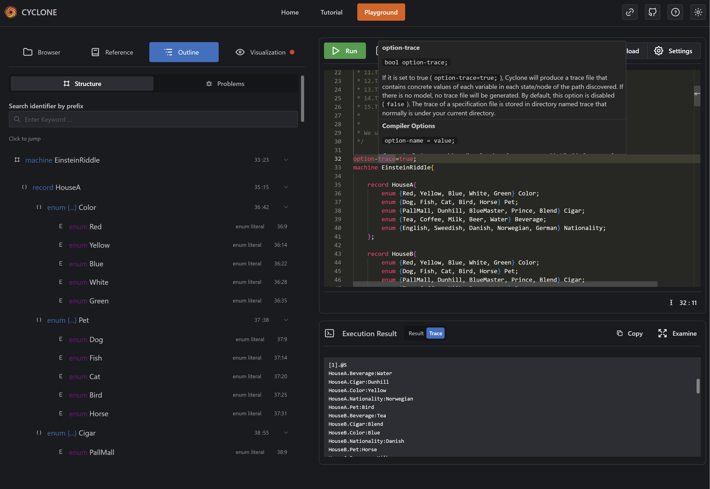

# Cyclone Online Editor

Cyclone online editor is an online development environment for the [Cyclone Specification Language](https://classicwuhao.github.io/cyclone_tutorial/tutorial-content.html). 

The website includes an online editor, a tutorial page and a playground designed for learning cyclone & developing cyclone source code online.

This project is a final year project (CS440[A]) at Maynooth University.

## TODO
- This Document
- Add more code examples
- Add more tutorials
- Styling improvement
- Fix bugs & finish TODOs

## Features

Website Features:
- Written in React & Next.js for a better performance
- Using [Monaco Editor](https://microsoft.github.io/monaco-editor/), the editor that powers VSCode, as the underlying code editor in order to get a closer user experience of VSCode
- Responsive layout and using [Mantine](https://mantine.dev/) as the UI framework
- Dark Mode

Editor Features:
- **Syntax Highlighting:** Display highlighted source code and supports multiple themes.
- **Syntax, Semantic & Type Checking:** Check cyclone source code for syntax errors, type errors and semantic errors & warnings. Errors will be highlighted in real-time on the editor.
- **Hover Information:** Display type info & reference docs when mouse hovered on keywords or identifiers.
- **Code Completion & Snippets:** Provide auto-completions & snippets when typing. Scoped identifiers could be provided as well.
- **Code Execution:** Execute cyclone source code online & get result and traces.

Playground Features:
- **File Browser:** Provides a file browser to load official examples instantly, also user may save (or load) their source code inside the browser.
- **Quick Reference:** Look up language keywords, build-in functions & operators, compile options instantly.
- **Code Outline:** View code structure in a tree and jump to definition in one click just like VSCode. Also view all errors & warnings as list.
- **Visualization:** Preview cyclone's state & edge (transition) defined in the source code as graph using [Graphviz](https://graphviz.org/) in real-time. View execution result & trace as images.

Development Features:
- Easily managing code snippets, code examples and editor themes.
- Add additional tutorial chapters & reference documentation to the website **using only markdown**. No need to manually writing JSON manifest.
- Uses static-site generation technique to generate static pages automatically
- Using [ANTLR4](https://www.antlr.org/) as the parser generator. Upcoming language features could be added easily
- No large JSONs are imported, all static resources are dynamically requested to get a better user experience

## Screenshots





## Getting Started
Clone this repo to any location, run:
```shell
cd cyclone-online-editor
npm install # or yarn install
npm run prep # prepare environment
```

### Execution Server

If there is no existing execution server ready, it must be prepared as well:

```shell
cd execution_server
npm install
```
Please make sure that java environment is installed and cyclone's compiler could be executed locally.

Then configure the cyclone environment by editing `execution_server/src/config.js`. Please notice that `cyclonePath` must be correctly set to cyclone's compiler path.

### Launch Frontend
The environment is now ready. To start the dev server, run:
```shell
npm run dev
```

To deploy on a server, run:
```shell
npm run build
npm run start
```

These are just standard Next.js operations. All Next.js operations should be supported since this project is built upon Next.js.

## Development

### Project Structure

Here is a basic structure for the project:
```
.
├── execution_server
│   └── src
├── public
│   ├── dynamic
│   └── vs
├── raw
│   ├── code_example
│   ├── grammar
│   ├── reference
│   └── tutorial
├── resource
│   ├── image
│   └── tutorial
├── scripts
│   └── utils
└── src
    ├── component
    ├── core
    ├── generated
    ├── lib
    ├── pages
    ├── state
    └── styles
```

There are several directories that worth noticing:

| path              | description                                                                                                                                                                                                                                                                                           |
|-------------------|-------------------------------------------------------------------------------------------------------------------------------------------------------------------------------------------------------------------------------------------------------------------------------------------------------|
| /execution_server | The execution server that executes cyclone code. Consider this the 'backend' of the editor.                                                                                                                                                                                                           |
| /public           | Static files for Next.js. Some of the generated files are included.                                                                                                                                                                                                                                   |
| /public/dynamic   | Stores generated code example, reference document and editor theme definitions. Please do not edit them directly                                                                                                                                                                                      |
| /public/vs        | Stores resource files that are required by the editor component (monaco editor)                                                                                                                                                                                                                       |
| /raw              | Stores raw resources for code examples, ANTLR4 parser & lexer rules, reference documents and tutorial pages (both in Markdown)                                                                                                                                                                        |
| /resource         | Stores generated tutorial HTMLs, images, resource manifests and some configurations in JSON.                                                                                                                                                                                                          |
| /scripts          | Stores code generation scripts in JS and Shell. Execute these scripts only at repo's root directory and DO NOT execute them anywhere else.                                                                                                                                                            |
| /src              | Source code directory. Component structures are equivalent to Next.js page router's structure and `core` contains the core logic for the semantic checker and other modules of cyclone. Please do not touch `generated` directory since these codes are generated automatically by scripts and ANTLR4 |

### Managing Resources

There are several resources included by the website: 
- Code Examples
- Editor Theme
- Tutorial Documents
- Reference Documents

These resources could be managed easily and their manifests can be automatically generated using scripts.

#### Code Examples

Code examples are cyclone source code files that represents official code examples to show to the user. Code examples are placed at `raw/code_example` directory. Adding code examples by creating `.cyclone` files inside the folder and the filename will be used as title.

After creating, make sure to run this command to update the manifest:
```shell
# MAKE SURE TO RUN THIS AT REPO'S ROOT (Where package.json lies)
npm run gencodeexample
```

The manifest file of all code examples are at `resource/code_example_manifest.json`, and please do not edit it directly since it's a generated file.

#### Editor Themes

Editor themes are monaco editor's color scheme configuration that used by users. VSCode themes could be converted [here](https://vsctim.vercel.app/). A theme file is a JSON file that represents a color scheme.

This project uses [monaco-themes](https://github.com/brijeshb42/monaco-themes) to provide several color schemes. If you wish to add your own color schemes, edit `scripts/generate_theme.js` and add the path that holds all the JSON file into `themePaths` array. Finally, run this:

```shell
# MAKE SURE TO RUN THIS AT REPO'S ROOT (Where package.json lies)
npm run gentheme
```

And all the theme files should be copied to `/public/theme`. File names will be used as theme titles and a variation of filename will be used as theme identifiers.

#### Tutorial documents

Tutorial documents are Cyclone's tutorial documents written in Markdown. These documents are placed inside `/raw/tutorial` and could be edited directly.

If you wish to add a tutorial document, create a new markdown file that holds the content. The filename of the tutorial represents the id. In each document, add these configurations on the head of the markdown:

```markdown
---
# The title of the document
title: "0.2 Installation"

# Previous and next document that used for navigating, written in ID
prev: "01-what-is-cyclone"
next: "11-understanding-cyclone-spec-lang"

# Document order number. The website's menu will display them in ascending order
order: 2
---

... Document Main Content ...
```

Please notice that there is a `_default.md` inside that directory. This file represents the main page (table of content, or anything you wish) for the tutorial. In this file's configuration, only `title` and `next` is needed. Please do not delete this file.

If any changes happened to any documents, make sure to run this to re-generate html files from markdown:

```shell
# MAKE SURE TO RUN THIS AT REPO'S ROOT (Where package.json lies)
npm run gentutorial
```

And then documents will be generated as HTML files for Next.js to load also a manifest is automatically generated.

For code blocks inside tutorial, if a code block contains a `machine` block or `graph` block, a shortcut to execute the code will be displayed on UI when user browsing.

#### Reference Documents

Reference documents are simple documents that describes the language components such as keywords, operators or compiler options. These documents will be displayed when:

- User is at playground's reference panel, and user could visit all reference documents
- User's mouse is hovering on some keyword, identifier or operator on the editor, and the document (if exists) will be popped up for user to examine its info (like VSCode)

These documents are separated by categories and called *groups* inside manifest. A group is just a folder containing markdown files that describes a certain keyword. For example, 'Builtin Functions' could be a group, and each builtin function should be a separate Markdown document. 

The root folder for reference documents is at `raw/reference`. Each sub-folder inside that directory represents a group. 

To create a group, create a folder inside that directory and put Markdown documents inside. A valid group (sub-folder) should contain a `_group.md` with optional description of group content, but these configurations must be written at the head of that file:
```markdown
---
# These info are always required even if this file have no text content

# Group title
title: "Compiler Options"

# Optional. 
# If you wish to display this document's content every time when user hover on some keywords belongs to the group on the editor, you could specify these.
# It will be meaningless if this document have no content.
keywords: ["option", "log", "trace"]

# Unique group ID
id: "cmp_opts"
---

... OPTIONAL content, if no text is here then it will not be generated to HTML ...
```

Please note that `keyword` is an optional array that contains keywords that would trigger this document when user's mouse hovering on the source code. Keywords could be duplicated in multiple documents: A keyword could have many documents displayed on editor, and a document could have many keywords that wish to trigger when user hovers on.

To create reference docs belongs to certain group, just create Markdown files that describe certain keywords and make sure these are written on the head:
```markdown
---
# title of the document
title: "Fresh ()"
# keywords of cyclone which user can trigger by hovering cursor on 
keywords: ["fresh"]
# An ID that should be unique to other files inside a same group
id: "fresh"
---

... Content, an additional title is not needed ...
```
Please notice that since the config has a title, an additional title inside the content such as `# Some title` is not needed.

Finally, make sure to re-generate the manifest and HTML files when changes happened:

```shell
# MAKE SURE TO RUN THIS AT REPO'S ROOT (Where package.json lies)
npm run genref
```

### Execution Server

The execution server is a simple server that provide the ability to execute cyclone's source code and collect its result. In the online editor, the address for the execution server could be manually settled.

The default execution server is written in Node.js & Koa.js and locates at `execution_server/`.

#### Configuration
In the source code of the server there is a configuration module called `src/cofig.js`. This file contains a basic config of the execution server:

```javascript
const config = {
  // is this server been deployed using a reverse proxy (koa options)
  isProxy: false,
  
  // server host and port
  host: "127.0.0.1",
  port: 9000,
  
  // Cyclone executable file, used with cyclonePath
  cycloneExecutable: "cyclone.jar",
  
  // Cyclone executable file's location
  cyclonePath: "path/to/cyclone/folder/",
  
  // The keyword in the execution result that indicates there is a trace generated
  // Modify this only when cyclone's output format has been changed in future versions
  cycloneTraceKeyword: "Trace Generated:",
  
  // Temporary directory that contains
  tempDir: path.join(os.tmpdir(), "cyclone_tutorial_backend"),
  
  // Should the sever delete temp files immediatly after each execution (might slow down performance)
  deleteAfterRun: false,
  
  // Cyclone's extension
  cycloneExtension: ".cyclone",

  // Options that the server doesn't allow to set
  // These option might create additional meaningless files, not good in production
  cycloneDisabledOptions: new Set([
    "debug",
    "log",
  ]),
  
  // A mandatory timeout for cyclone's execution in ms
  // Set this to 0 to disable this feature
  cycloneMandatoryTimeoutMs: 2000
}
```

Mainly when you're deploying the server, the `tempDir` and `cyclonePath` is worth noticing.

#### Clearing Files
During each round of execution (each request) there will be 2 possible temp files generated. One is the source code and the other is a `.trace` file if user enabled trace option.

There are 2 strategies for clearing these files:
- Set `deleteAfterRun` option to `true` in config and files will be deleted every execution, which will slow down performance a little bit.
- Write a scheduled task with cron (or other methods) to routinely clear these files.

The second method is recommended in production.

#### Build Your Own Server
If you don't like the existing execution server, you could build your own. Just make sure that the server could execute Cyclone's source code and get the result & trace.

The server is required to have a `POST /run` API that accepts a JSON structure of:
```json
{
  "program": "machine ExampleCycloneProgram {...}"
}
```

The only parameter `program` is the source code and the json will be sent via the request body. CORS is recommended to enable since the frontend address might be different from the backend.

After received `program` as source code, server should find a way to execute it as Cyclone program. There are various methods to do this, including creating sub-process, import JAR by Java's class loader, direct call cyclone's method from its compiler, etc...

In the end, a result and an optional trace string should be obtained as the code's execution result inside console, and the code's optional trace file. These 2 strings should be put inside response.

For the response structure, the `/run` API takes this JSON format:
```json5
{
  // Response status, enum value
  // possible values are defined in execution_server/src/definitions.js
  "code": 1,

  // Response data, any type
  // When code = 1 (success), it's the execution result and trace
  // When code = 3 (InvalidOptions), it should be the options that disallowed on the server config, or nothing
  // When code = 6 (ExecutionTimeout), it should be the timeout that server accepts in ms
  "data": {
    // Example response data structure for success result
    
    // String | null | undefined
    "result": "Result output on the terminal",
    // String | null | undefined
    "trace": "Possible trace file content, if user enabled trace"
  }
}
```

During execution there might be errors. The frontend now can handle 6 kinds of response status, which was defined at `execution_server/src/definitions.js`. There are these status:
```javascript
export const ResponseCode = {
  // Executed successfully and result was obtained
  Success: 1,
  // The code has some kind of syntax error
  SyntaxError: 2,
  // Some options are not supported on the remote server
  InvalidOptions: 3,
  // Execution failed
  UnsuccessfulExecution: 4,
  // Other internal errors
  InternalError: 5,
  // It took too long to execute the cyclone program
  ExecutionTimeout: 6
}
```

Please do notice that Cyclone exposed certain sensitive file paths in the execution result and trace file. It is recommended to replace them using Regex or other methods to prevent leaking sensitive information.

### Configurations

Certain levels of configurations are available for the editor. Apart from `next.config.js` (the Next.js config file), there are several config files inside `resource/` directory. 

*Please do not touch any files that ends with `_manifest` inside that directory since these files are generated automatically.*

#### Cyclone's Language Config
In case Cyclone adding new keywords and operators, there is a file called `resource/cyclone_spec.json` that contains all cyclone's existing keywords, literals, types, options and operators.

If cyclone added new keywords in the future, remember to update this file.

#### Website Config
The website config is the `resource/config.json` file. In this file you could change some basic options for the website:
```json5
{
  "editor": {
    // Editor's maximum error display amount
    "errorStorageLimit": 1000
  },
  "executionServer": {
    // Execution server's default URL, should change this in production
    "url": "http://127.0.0.1:9000"
  },
  "home": {
    // The code example that on the home page
    "exampleCode": " /* A Simple Graph\n  * Demonstrate how to use path conditions.\n  */\n\ngraph G{\n\n    /* the set of nodes */\n    abstract start node S1{}\n    abstract node S2{}\n    \n    \n    /* the set of edges */\n    edge { S1 -> S1 }\n    edge { S1 -> S2 }\n    edge { S2 -> S1 }\n    edge { S2 -> S2 }\n    \n    goal{\n\n        /*\n         * Find a path (starts from node S1) that \n         *  has a length of 5, \n         *  must not include self-loops,\n         *  and eventually reach S2.\n         */\n        check for 5 condition (!(S1->S1) && !(S2->S2)) reach (S2)\n    }\n\n}"
  }
}
```

### Further Developing

If you wish to develop this application further, there are certain things that worth noticing.

#### Definitions
The file `src/core/definitions.js` contains enum definitions for cyclone's components including types, code block kinds, identifier kinds, etc...

All variables in this file are written in JavaScript object but used as enumerations. When updating these enum definitions, please don't use duplicated value.

#### Code Highlights Inside Documentations
Some of the code inside documents are highlighted. This is because the project introduced Highlight.js library and a spec file to do this.

To change the rules for highlight.js, please visit `scripts/utils/highlight_spec.mjs`. This file is imported by another script and the project itself. For the script it must evaluate the return value of `highlightSpecCode` function and get the rules, and that return value will be copied into `src/generated/hljs/cyclone.js`.

Doing this complicated code generation is because it's the only way to make both Node.js and Next.js happy... The actual reason is written in that file as comments.

#### ANTLR4 Parser & Lexer
The ANTLR4 parser and lexer is inside `raw/grammar` directory. The parser is specially designed for listening to some blocks via ANTLR listeners.

If these files are changed, please make sure to run this:
```shell
# MAKE SURE TO RUN THIS AT REPO'S ROOT (Where package.json lies)
npm run genparser
```

Please notice that [the ANTLR4 development environment must be installed](https://github.com/antlr/antlr4/blob/master/doc/getting-started.md) in order to execute the above command.

#### Monaco Editor
The website uses monaco editor to provide code editing features. The basic definitions for the editor, including syntax highlighting and other patterns, are inside `src/core/monaco/language.js`.


## Third Party Dependencies

This project mainly uses these third party dependencies:

- *React, Next.js:* For the fundamental of this application
- *Mantine UI:* For UI components
- *Monaco Editor:* The editor framework underlying the online editor
- *ANTLR4:* Parser generator for generating parser for cyclone.
- *D3.js, D3-graphviz:* Provides visual component for graphviz code used in visualization module.
- *Highlight.js:* For highlighting code elements inside raw html
- *Zustand:* State managing library for React
- *Unified, Remark:* Generating Markdown documents to HTML
- *Localforage:* Browser's persistent data management library

There are other dependencies used, please see `package.json` for details.

## Licence

Published under the [MIT license](https://tldrlegal.com/license/mit-license).